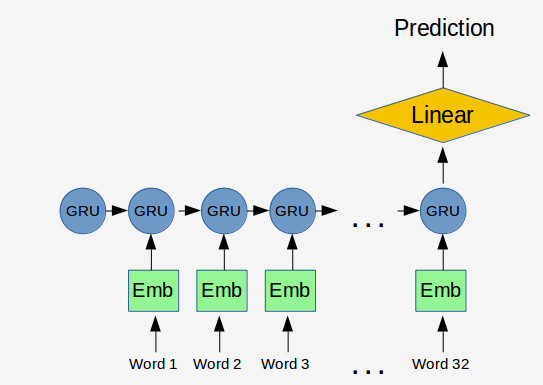

# Building a Language Detection Algorithm

This repo builds a language detection model that can be used for the 21 languages spoken in the European Union. For any given text, the model predicts its language.

This project is one of the challenge problem for the fellowship.ai application. The application organizers asked to build a model on the [EU Parliament Parallel Corpus](http://www.statmt.org/europarl/) a corpus of ~5 GB of text files (1.5 GB zipped). They also supplied the [test](https://storage.googleapis.com/google-code-archive-downloads/v2/code.google.com/language-detection/europarl-test.zip) set to evaluate predictions on. 

## Summary

The model that achieves near-perfect (99.9%+) test set accuracy. While fitting the model to the whole data takes a significant amount of computation time (~2 hours), the same model fitted to a 1% subsample of the training data also achieves very good results (XXXX).

The table below lists the model results based on sample size. 

| Dataset           | Model              | Accuracy           | Training Time      | Inference Time     | Vocabulary size    | Link              |
| ------------------ | ------------------ | ------------------ | ------------------ | ------------------ | ------------------ | ------------------ |
| Full Dataset  | Word Level      | 99.96%             | 130 min      | 1.22 secs | 403619         | [here]() |
| 10% Sample    | Word Level      | 99.90%             | 12  min      | 1.22 secs | 433309         | [here]() |
| 1% Sample     | Word Level      | 98.79%              | 1   min      | 1.17 secs | 151746         | [here]() |
| 1% Sample     | Character Level | XXXX               | XXX min      |           | XXX            | [here]() |

Training time involves all preprocessing and model fitting (but not download time). Inference time involves predicting the ~20k sentences of the test set. The runs are done on a google cloud virtual machine with P100 GPU (the notebook contains full specification).

## Model Description

The model is based on a recurrent neural net. After some very basic preprocessing, I embed words into a 50 dimensional  space. I feed the resulting embeddings through a standard GRU followed by a linear layer.

The [main notebook]() contains detailed steps; as well as justification behind the hyper-parameter choices.